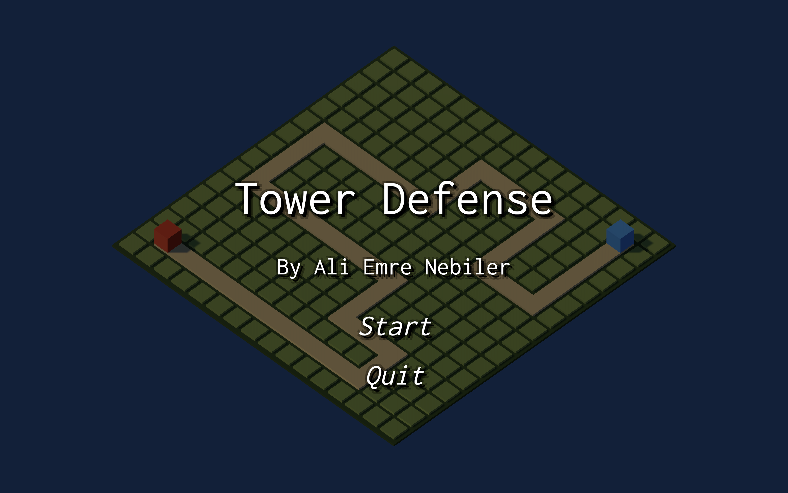
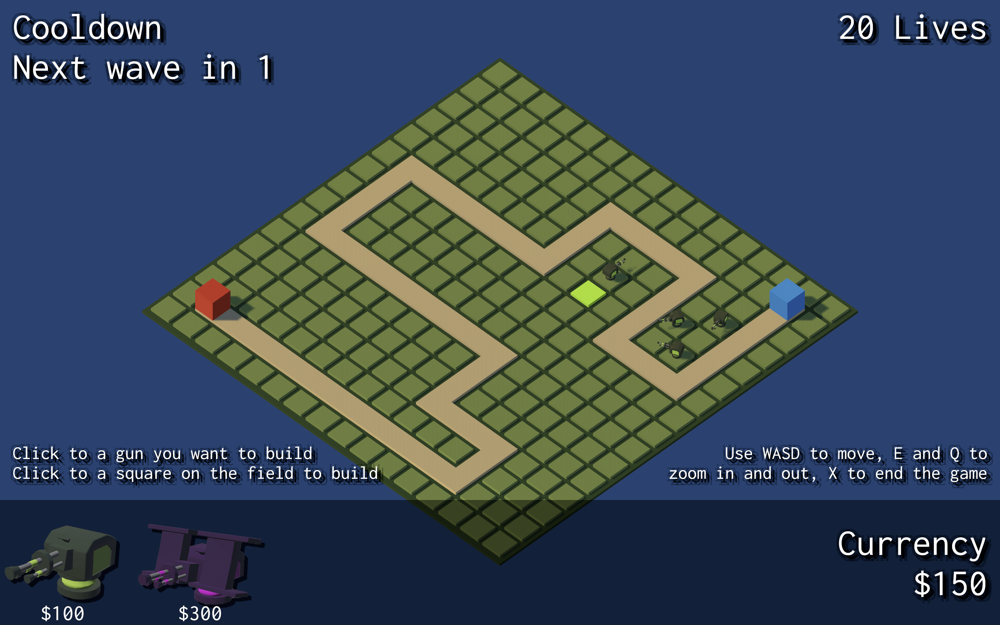
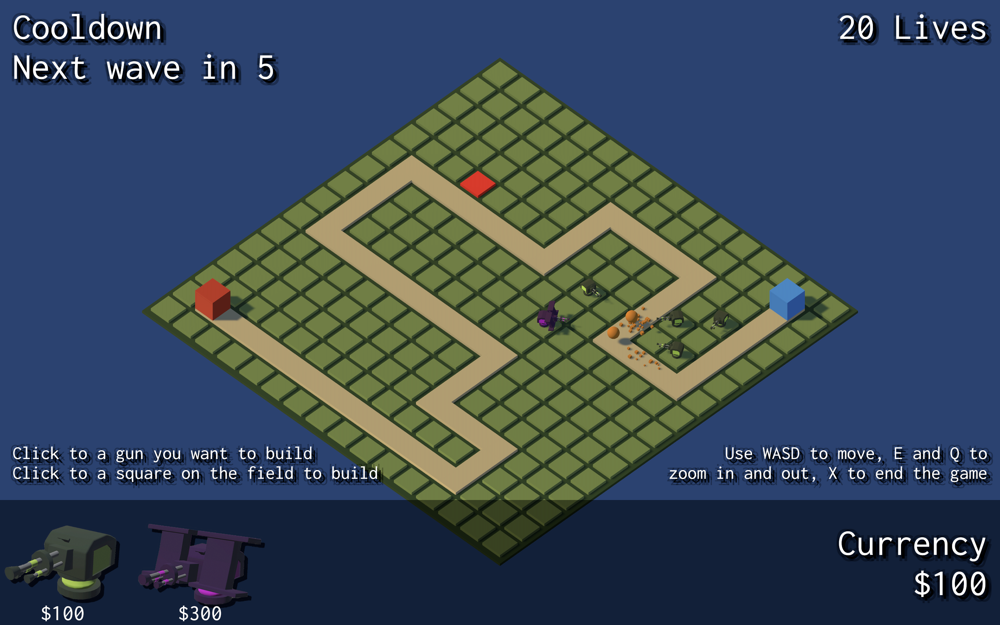
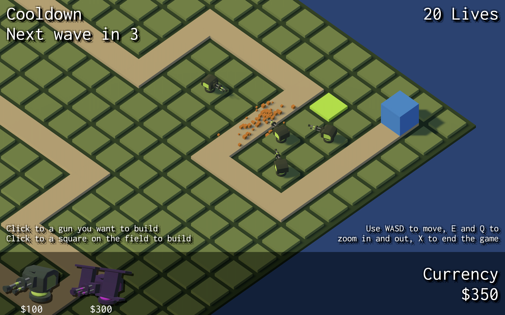
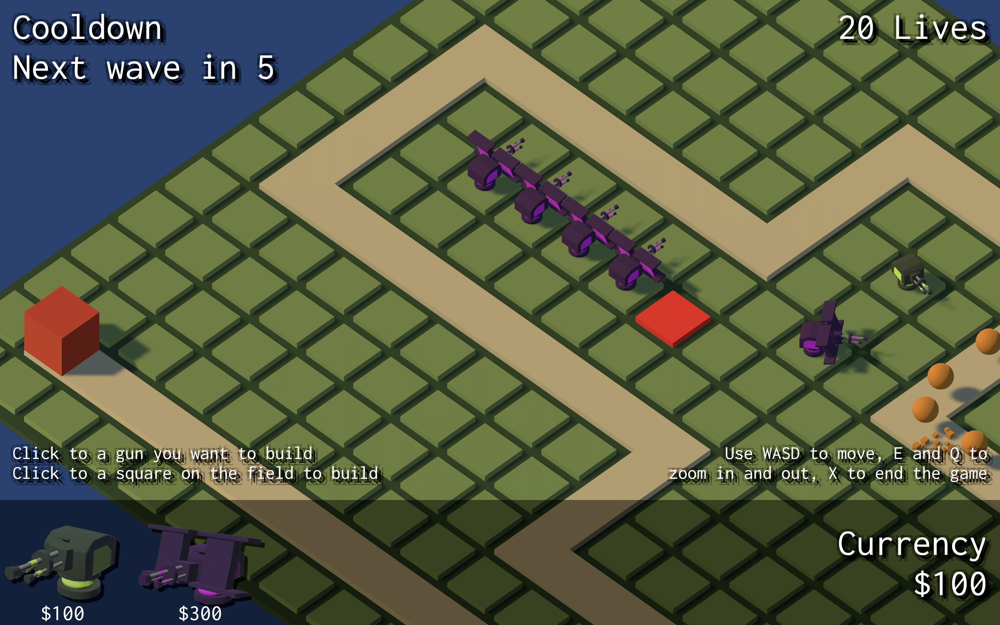
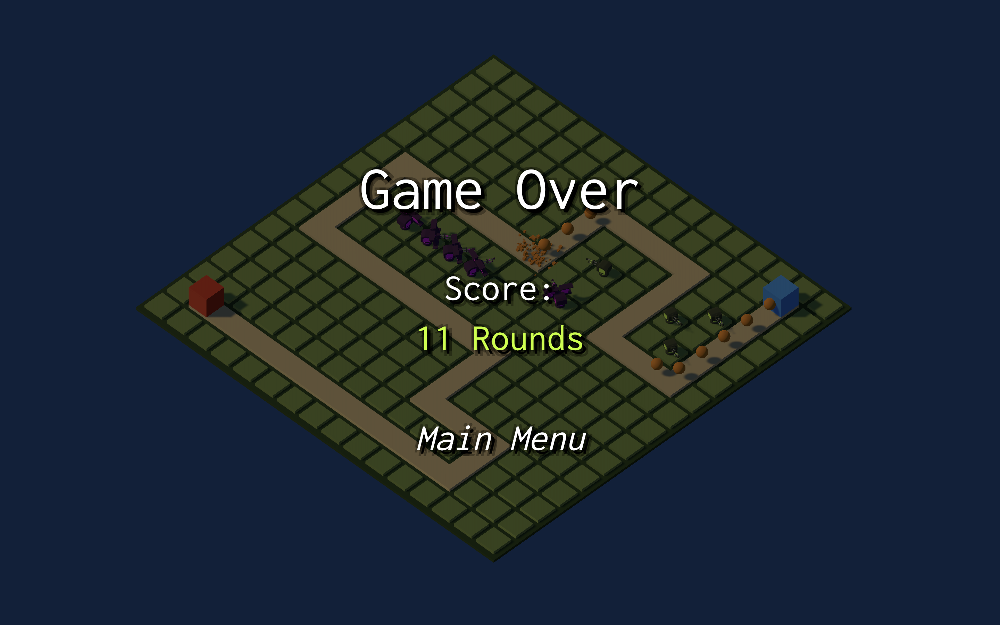

# Tower_Defence_Game

This was a school homework I made for Introduction to Game Development class.

I watched this tutorial to make the game:
https://www.youtube.com/playlist?list=PLPV2KyIb3jR4u5jX8za5iU1cqnQPmbzG0

All the assets are also from the tutorial. Thanks to Asbjorn Thirslund for these amazing videos.
https://github.com/Brackeys

## Rules

- The main goal is to survive in rounds as many as possible.
- You will defeat the spawning enemies by placing turrets (guns) to the nodes on the field. These turrets will shoot the enemy.
- Every defeated enemy will make you earn money. You will need more money to build new turrets.
- If any enemy arrives to the end point, you will lose one life.
- When you are out of lives, game ends.

## How To Play?

- To start the game, press the start button.
- Use W, A, S, D to move around, Q to zoom out, E to zoom in.
- Use your mouse to select a turret and click on any avaliable node on the field to build it.
- You can switch to mouse mode to control the movement with mouse by pressing escape key. When this mode is active, you can move your mouse to the screen borders to move. Or you can zoom in and out with your mouse scrollwheel.

## Snapshots

  
  

<!-- 
|  |  |
|  |  |
|  |  | -->